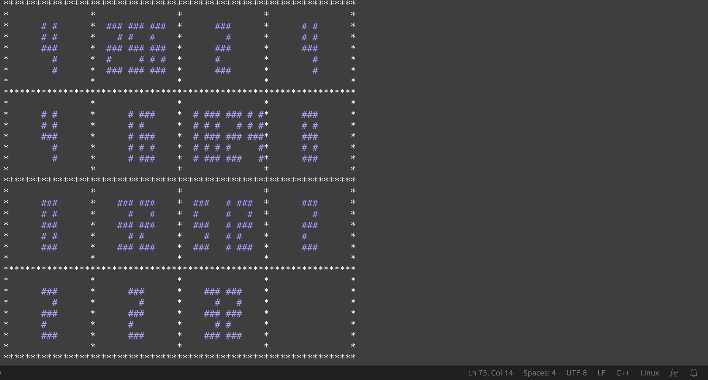
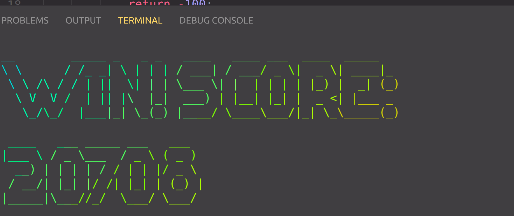
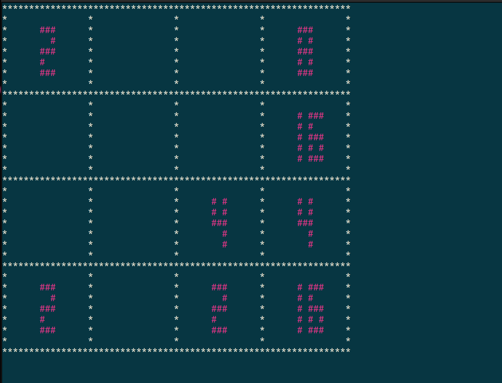
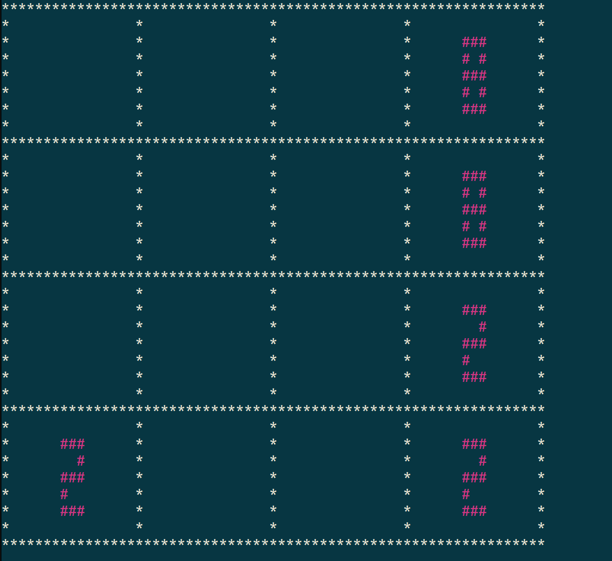

# C++ 2048 


>  基于C++面向对象编程的Linux终端小游戏


作者：汪福运

Nanjing University, School of Artificial Intelligence.

## 1.环境配置

Linux系统下

首先确保安装

```shell
g++

ncurses　库

figlet  终端工具

lolcat 　终端工具
```

```shell
sudo apt-get install figlet

sudo apt-get install lolcat
```

## 2. 使用方法

Makefile中设计了3个命令

1. 清空当前文件夹下的可执行文件

```shell
make clean
```

2. 使用自己设计的Agent玩2048小游戏

```shell
make run
```

3. 人工玩2048小游戏

```shell
make play
```

## 3.设计Agent的方法

在yourplayer.h头文件中实现所必须的两个函数

```c
double getReward(const Matrix &matrix)
```

```c
ACTION run(const Matrix &matrix, int seed = 4)
```

为了便于对环境的模拟,提供了如下的API用于完成该函数

```c
 * matrix[i][j] 访问游戏中当前位置的方块中的值,若当前位置没有值,则返回0
 * matrix.getAvailabelActions() 返回当前所有可行的行动vector
 * matrix.score() 返回当前状态的得分
 * matrix.getGameState() 返回游戏当前的状态
 * matrix.update() 返回新的matrix,用于模拟中的未来的状态,参数为你选择的行动.
```

>  提供了我自己写的RandomMctsPlayer作为设计Agent参考
>
> 包含mctsnode和RandomMctsPlayer头文件.

## 4. 运行结果展示









